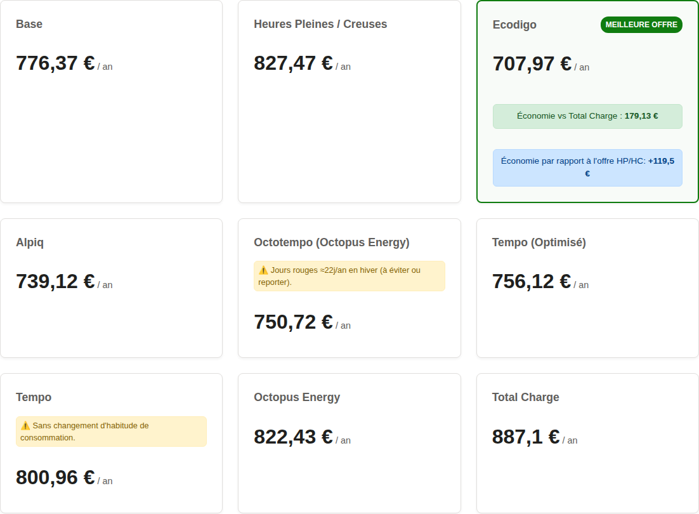
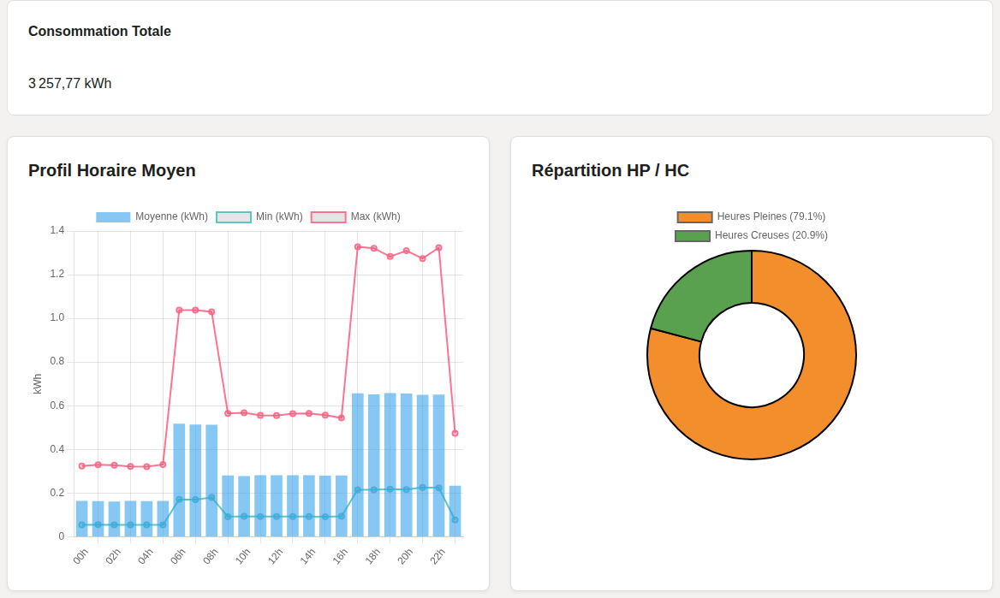

# ⚡ ComparatifElec

**Quelle offre d'électricité est vraiment la moins chère pour vous ?**

Importez votre historique de consommation Enedis, comparez en un clic
Base, HP/HC, Tempo et vos propres tarifs personnalisés, simulez une
installation photovoltaïque, et exportez le résultat en PDF ou Excel.
Tout se passe dans votre navigateur.

### 👉 [**elec.remcorp.fr**](https://elec.remcorp.fr) 👈

 

## Pourquoi cet outil ?

Le simulateur de votre fournisseur ne compare jamais qu'une seule offre à
la fois, et rarement avec votre consommation heure par heure. Entre Base,
HP/HC, Tempo (jours Bleu/Blanc/Rouge) et les offres alternatives, le
classement dépend en réalité de votre profil réel de consommation — pas
d'une moyenne nationale.

ComparatifElec importe votre export Enedis (JSON/CSV/Excel) et recalcule,
heure par heure, ce que chaque offre vous aurait vraiment coûté sur la
période — y compris les tarifs que vous définissez vous-même.

## Ce que vous pouvez faire

- 📂 **Importer vos données Enedis** (JSON, CSV ou Excel) et visualiser
  votre profil de consommation horaire, votre répartition HP/HC et votre
  talon de consommation (veille)
- 💰 **Comparer les offres en un clic** : Base, HP/HC, Tempo, Tempo
  optimisé, TCH — et **ajouter vos propres tarifs personnalisés** (fichier
  JSON, sans toucher au code)
- ☀️ **Simuler une installation photovoltaïque** : puissance, région,
  autoconsommation vs injection réseau, et calcul du retour sur
  investissement
- 📤 **Exporter en PDF ou Excel** (résumé, offres, détail mensuel, données
  brutes) pour partager ou garder une trace
- 🔗 **Partager un lien** : le scénario est encodé dans l'URL, la personne
  qui l'ouvre voit exactement la même analyse

## Ce que vous obtenez

- Le **classement des offres** sur votre consommation réelle, avec le prix
  moyen au kWh de chacune
- Des **graphiques** : profil horaire moyen, répartition HP/HC, coût
  mensuel par offre, économies apportées par le solaire
- Un **calendrier Tempo** avec le détail jour par jour
- Un **historique local** de vos dernières analyses (jusqu'à 20)

## Vos données restent chez vous

Application 100 % front-end — aucun calcul, aucune donnée n'est envoyée à
un serveur.

- Vos analyses sont **sauvegardées dans votre navigateur** (localStorage)
- **Exportez/partagez** un scénario via un lien encodé, sans jamais
  transiter par un serveur tiers

## Envie de contribuer ou de faire tourner le projet en local ?

Toute la partie technique (architecture des modules, ajout d'un tarif
personnalisé, CI/CD) est documentée séparément dans
[`docs/DEVELOPMENT.md`](docs/DEVELOPMENT.md).

## Licence

Aucune licence n'est actuellement définie pour ce projet. En l'absence de
licence, les droits par défaut du droit d'auteur s'appliquent (tous droits
réservés). Si une réutilisation ouverte est souhaitée, l'ajout d'un fichier
`LICENSE` (MIT, par exemple) est recommandé.
